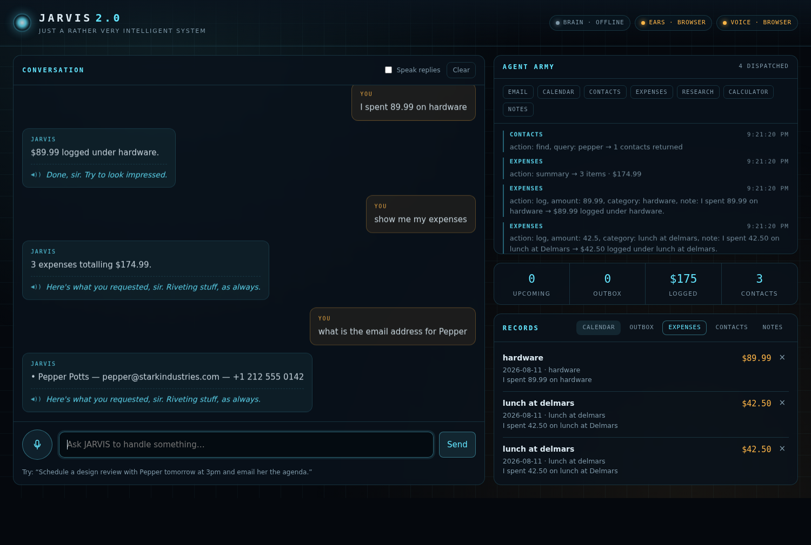

# JARVIS 2.0 — voice dashboard

A web app for talking to JARVIS in his own voice and having him actually carry
out tasks. It is a direct port of the **JARVIS 2.0** n8n workflow: the same
router-plus-agent-army design, the same two-pass personality trick, and the same
ElevenLabs voice — with the browser replacing Telegram as the front end.



*Above: running with no keys at all — the built-in command parser handling
expenses and contacts. Add `ANTHROPIC_API_KEY` and he reasons about multi-step
requests instead.*

## How it maps to the n8n workflow

| n8n node | Here |
| --- | --- |
| Telegram Trigger + Switch (voice / text) | The composer in the browser: type, or hit the arc reactor to speak |
| Download File → Transcribe | `POST /api/transcribe` → Whisper (falls back to the browser's speech recogniser) |
| Assistant Agent + OpenAI Chat Model | `server/jarvis.js` → Claude with tool use, same router system prompt |
| Window Buffer Memory (keyed on chat id) | `server/memory.js`, keyed on the browser session id |
| Email / Calendar / Contact / Research / Expense agents, Calculator | `server/agents.js` — seven tools the router can dispatch to |
| JARVIS Personality + Anthropic Chat Model | Second pass in `server/jarvis.js`, same personality prompt |
| Text to Speech (ElevenLabs) | `POST /api/speak`, voice id `h029Xu7odsKARnf0xDjw` |
| Response + Message (Audio) | The transcript shows the factual answer; the spoken line is the witty one |

The two-pass split is the part worth keeping: pass one reports the facts, pass
two says something Jarvis would say. The dashboard **shows** the first and
**speaks** the second, so you get the detail on screen without him reading a
list of numbers aloud.


## Sofort benutzbar: die eigenständige Version

`standalone/jarvis.html` ist die ganze App in einer einzigen Datei — kein Server,
kein `npm install`, kein API-Key nötig. Herunterladen, doppelklicken, fertig.

- **Kostenlose Stimme.** Sie spricht mit den Stimmen, die dein Betriebssystem
  ohnehin mitbringt (`speechSynthesis`). Unter „Stimme & KI“ sind sie danach
  sortiert, wie nah sie an JARVIS' Register liegen; Tempo und Tonhöhe sind
  einstellbar, die JARVIS-Voreinstellung setzt beides auf einen tiefen, ruhigen
  Ton. Kein Konto, keine Kosten, kein Limit.
- **Spracheingabe** über die Web Speech API — Mikrofon-Knopf drücken, sprechen.
  Funktioniert in Chrome und Edge. Wichtig auf dem Handy: Sprache gibt das
  Betriebssystem nur über eine sichere https-Verbindung frei. Eine Datei, die
  direkt aus dem Speicher geöffnet wird (Android: `content://`), bekommt kein
  Mikrofon — dort meldet JARVIS das im Klartext statt mit „not-allowed“.
- **Als App installierbar.** Über den gehosteten Link → „Als App installieren“
  landet JARVIS auf dem Startbildschirm und startet ohne Browser-Leiste. Damit
  läuft er auf einem sicheren Ursprung, und das Mikrofon funktioniert.
- **Deutsch und Englisch**, umschaltbar oben rechts. Das betrifft Oberfläche,
  Erkennung, Sprachausgabe und die Befehle selbst.
- **Lokaler Modus.** Ohne Key versteht JARVIS direkte Befehle und führt sie aus:
  „Termin mit Pepper morgen um 15 Uhr“, „Ich habe 42,50 für Mittagessen
  ausgegeben“, „Was steht diese Woche an?“, „Telefonnummer von Rhodey“,
  „Schreib eine Mail an Happy betreff Werkstatt“, „Notiere: …“, „15% von 200“.
- **KI-Modus.** Trägst du unter „Stimme & KI“ einen Anthropic-Key ein, denkt er
  mit und kombiniert mehrere Schritte. Der Key bleibt im Browser und geht nur an
  Anthropic. Das funktioniert nur in der lokalen Datei — die gehostete Fassung
  darf keine fremden Server aufrufen.

Alles wird in `localStorage` gespeichert, ist also beim nächsten Öffnen noch da.

## Running it

```bash
npm install
cp .env.example .env     # add your keys
npm start                # http://localhost:3000
```

Every key is optional — the app tells you in the status bar what it is running
without:

| Key | Without it |
| --- | --- |
| `ANTHROPIC_API_KEY` | No reasoning. A small built-in parser still handles direct commands: arithmetic, logging an expense, reading the calendar, finding a contact, taking a note. |
| `OPENAI_API_KEY` | Speech is transcribed by the browser (`webkitSpeechRecognition`) instead of Whisper. |
| `ELEVENLABS_API_KEY` | Replies are spoken by the browser's speech synthesis, which picks an en-GB voice if one is installed. |

## What he can do

Ask in plain language; the router picks the agents and chains them where a task
needs it — "email Pepper the agenda" resolves the contact first, then drafts.

- **calendarAgent** — schedule, list, reschedule, cancel
- **emailAgent** — draft, queue, list, delete
- **contactAgent** — find, add, update (seeded with a few contacts)
- **expenseAgent** — log a spend, list, total by category
- **researchAgent** — writes a briefing and files it under notes
- **noteAgent** — notes and reminders
- **calculator** — arithmetic, evaluated by a small parser rather than `eval`

Everything the agents do is persisted to `data/jarvis.json` and shown live in
the Records panel, where you can also delete rows.

### Two honest caveats

- **Email doesn't leave the building.** No SMTP provider is wired up, so
  "sending" queues the message in the local outbox. Connect a provider in
  `emailAgent` to make it real.
- **Research has no live web access.** It's the model's own knowledge, written
  up as a briefing, and it says so in its output.

## API

| Route | Purpose |
| --- | --- |
| `GET /api/status` | Which capabilities are configured, and the agent roster |
| `POST /api/chat` | `{ sessionId, message }` → `{ reply, voiceLine, toolCalls }` |
| `POST /api/transcribe` | multipart `audio` → `{ text }` |
| `POST /api/speak` | `{ text }` → `audio/mpeg` |
| `GET /api/dashboard` | Records and totals for the panels |
| `DELETE /api/records/:collection/:id` | Delete one record |
| `POST /api/session/reset` | Clear the conversation memory |

## Layout

```
server/
  index.js       Express app and routes
  jarvis.js      Router loop, personality pass, dashboard state
  agents.js      The agent army, as Claude tool definitions
  llm.js         Anthropic Messages API wrapper
  voice.js       Whisper transcription, ElevenLabs synthesis
  memory.js      Window buffer memory per session
  store.js       JSON-file datastore
  calculator.js  Arithmetic parser
public/          Dashboard (no build step — plain HTML, CSS, ES modules)
```
